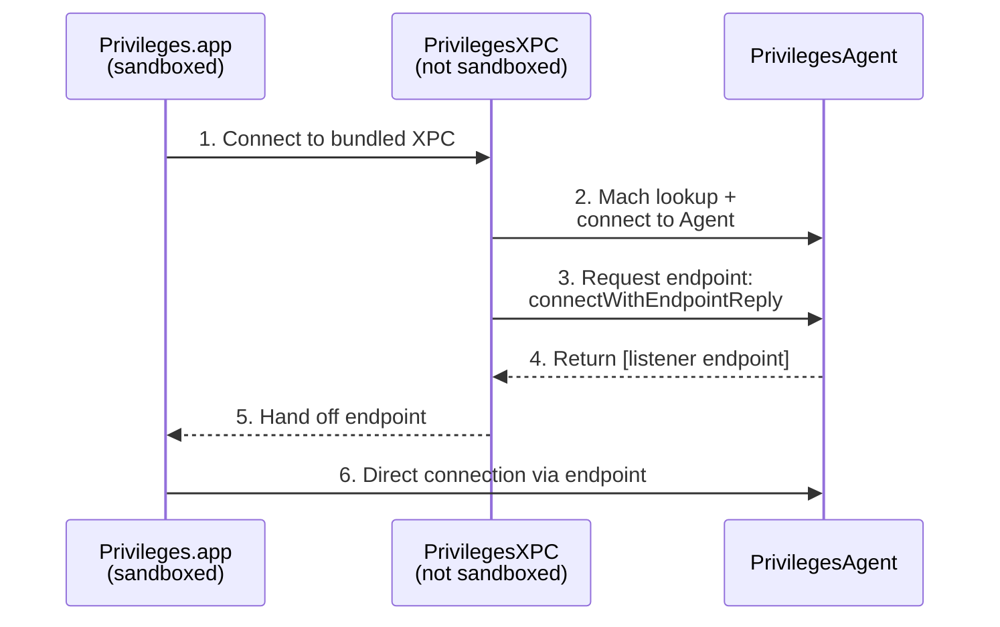
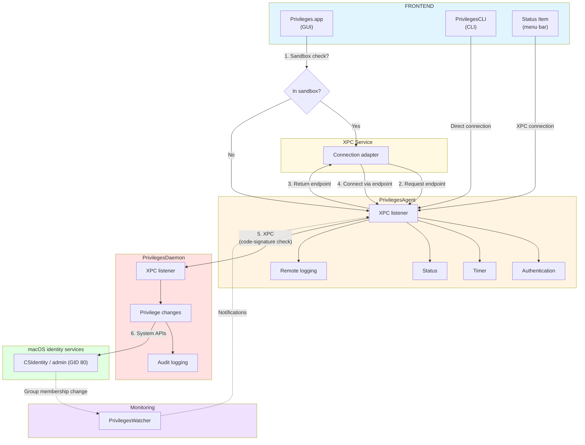

*This post is an English translation of the original (Russian) article: [Anatomy of SAP Privileges: how administrator rights are managed in macOS](https://habr.com/ru/companies/yandex/articles/1023708/) on [Habr](https://habr.com/) (Yandex corporate blog). Author: Bulat Gafurov.*

---

Hello! My name is Bulat Gafurov; I am a security engineer at Yandex. In this post I want to break down in detail how [Privileges](https://github.com/SAP/macOS-enterprise-privileges) works—an open-source macOS app for fast, convenient local administrator management. We will see how its components fit together, how messages are exchanged, and what trust between processes is built on. Most importantly, we will see why it is now much harder for malicious scripts to quietly elevate privileges.

It started with a search for a tool to grant local administrator rights “on demand,” because the classic two-account model did not fit us. The target audience is people who rarely need admin rights—for example, managers. I ended up on Privileges from SAP, probably the most common solution in this space.

I wanted to understand how it really works, and whether the user’s confirmation step for elevation could be skipped. If that mechanism can be bypassed, every “ClickFix”-style script will eventually abuse it, and the app is effectively worthless. I could not find a deep technical write-up of Privileges online, so I cloned the repository and dug in myself. I hope this material saves you time.

---

First, the main building blocks. To talk to the user, the app needs a UI. Here there are several: a GUI, a command-line tool (CLI), and a menu bar item.

All of them let the user request elevation or give up rights, and they all talk to the “backend”—**PrivilegesAgent**. The agent is responsible for:

* **Request handling:** accepting commands from the GUI and the CLI.
* **Authentication:** driving identity checks (biometrics, password, smart cards).
* **Timer management:** tracking how long elevated rights last and revoking them when the session ends.
* **Notifications:** telling the user that admin time is about to end.
* **Logging:** sending events to local and remote log pipelines (if configured).
* **Status updates:** driving the menu bar countdown.

Communication with the agent is XPC-based. An important architectural detail: if the app runs **sandboxed**, it cannot just do a `mach_lookup` to find the agent’s service.

To work around that, the bundle ships a helper **XPC Service**. It runs without the `com.apple.security.app-sandbox` entitlement, so it can act as a bridge: the front end talks to this service, and the service can connect to PrivilegesAgent.

## XPC Service vs. Mach service

To understand the architecture, it helps to know the XPC service categories. Per Apple’s docs, you can group them roughly as:

* **LaunchAgent:** runs in the user session; one instance per user.
* **LaunchDaemon:** a system service as root; one instance for the whole machine.
* **Bundled XPC Service:** lives inside the app bundle under `Contents/XPCServices`.

The key trait of a **bundled** XPC service: it is spun up per client at connection time, and its lifetime is tied to the process that created the connection.

For a developer, the main difference is how the connection is created.

**Example: connecting via `mach` lookup (Agent or Daemon):**

```text
_connection = [[NSXPCConnection alloc] initWithMachServiceName:kMTAgentMachServiceName options:0];
[_connection setRemoteObjectInterface:[NSXPCInterface interfaceWithProtocol:@protocol(PrivilegesAgentProtocol)]];
```

You look up the service in the global name space by its identifier. This is the step the **sandbox blocks** if the app lacks the right entitlements.

**Example: connecting to a bundled XPC service:**

```objc
_xpcServiceConnection = [[NSXPCConnection alloc] initWithServiceName:kMTXPCServiceName];
[_xpcServiceConnection setRemoteObjectInterface:[NSXPCInterface interfaceWithProtocol:@protocol(PrivilegesXPCProtocol)]];
```

The system knows the service is in the same bundle, so this path is allowed even for sandboxed apps.

So `PrivilegesXPC` is a trusted mediator: a sandboxed app talks to it, and it is allowed to reach the main agent.

For more on XPC services, see Apple’s documentation (for example, the XPC and `NSXPCConnection` material in the macOS developer library).

## Endpoint handoff: how a connection is “smuggled” into the sandbox

The main sandbox problem is that it forbids `mach_lookup` to find a service like `corp.sap.privileges.agent`. But XPC has a supported pattern: if one process already has a connection, it can hand it off to another.

That uses `NSXPCListenerEndpoint`—a serializable object that wraps connection information. It can be sent over XPC like any other parameter, and the receiver can build a real channel, including from inside a sandbox.

The flow looks like this.



**In the agent (`PrivilegesAgent`),** the service simply returns the listener’s endpoint in reply to a request:

```objc
- (void)connectWithEndpointReply:(void (^)(NSXPCListenerEndpoint *endpoint))reply {
    if (reply) { 
        reply([_listener endpoint]); 
    }
}
```

**In the app (`Privileges.app`),** after the bundled XPC service provides the endpoint, the app opens a direct connection to the agent without needing `mach_lookup`:

```objc
// Received an endpoint from the helper XPC service
NSXPCListenerEndpoint *endpoint = ...;

// Direct connection to the Agent, bypassing mach lookup
_connection = [[NSXPCConnection alloc] initWithListenerEndpoint:endpoint];
[_connection setRemoteObjectInterface:[NSXPCInterface interfaceWithProtocol:@protocol(PrivilegesAgentProtocol)]];
[_connection resume];
```

**Result:** a sandboxed app gets a full bidirectional channel to the agent even though it could not have located the service on its own.

## PrivilegesDaemon: running privileged work as root

The agent implements logic and timers, but it runs in the user session and **cannot** change group membership. For that it calls **PrivilegesDaemon**.

`PrivilegesDaemon` is a classic **LaunchDaemon** running as **root**—it does the privileged work of changing who is in the admin group.

Before the daemon can change group membership, `PrivilegesAgent` drives the system authentication UI. For example, with Touch ID enabled, the user must confirm as shown below.


When the agent needs to change rights, the daemon uses `CSIdentityAddMember` and `CSIdentityRemoveMember` to add or remove the user from the **Administrators** group (GID 80).

## Can you elevate “silently”?

If a CLI ships with the app, you might try to automate it. The obvious first try:

```text
/Applications/Privileges.app/Contents/MacOS/PrivilegesCLI -a
```

You do get admin rights, **unless** the policy requires password or biometrics. Otherwise `PrivilegesCLI` pauses and asks for Touch ID, a password, or a smart card.

The interesting part: `PrivilegesCLI` does **not** implement biometric auth itself. It goes through **PrivilegesAgent**, which calls the right API. After auth succeeds, the CLI calls `requestAdminRightsWithReason`.

Because “authenticate” and “request rights” are two separate steps in the CLI, you might ask: can I skip the identity check and go straight to the agent—or even the daemon?

The developers thought of that. The protections are at the **XPC** layer:

1. **Caller validation:** both the agent and the daemon inspect the caller’s **audit token** for incoming requests.
2. **Code signing:** the system checks not only the bundle ID but the **code signature**.
3. **Access control:** if `requestAdminRights` comes from a process whose signature does not match (e.g. a third-party script or a patched binary), the connection is rejected.

You cannot “pretend” to be the official `Privileges` CLI. A successful `requestAdminRights` call requires the same level of trust and the same signature as SAP’s real Privileges components.

## How code-signature checking works

Every XPC connection on macOS is tied to an **audit token**—a process identity the OS controls. When a client (CLI or app) connects to the agent or daemon, a three-step security check runs.

### Step 1: Read your own signature

The service (agent or daemon) uses `SecCodeCopySelf` and `SecCodeCopySigningInformation` to read its own signing data, so it can require the same “anchor” from clients.

```objc
SecCodeRef helperCodeRef = NULL;
SecCodeCopySelf(kSecCSDefaultFlags, &helperCodeRef);

SecStaticCodeRef staticCodeRef = NULL;
SecCodeCopyStaticCode(helperCodeRef, kSecCSDefaultFlags, &staticCodeRef);

CFDictionaryRef signingInfo = NULL;
SecCodeCopySigningInformation(staticCodeRef, kSecCSSigningInformation, &signingInfo);

// Extract the certificate Common Name (CN)
CFArrayRef certChain = CFDictionaryGetValue(signingInfo, kSecCodeInfoCertificates);
SecCertificateRef issuerCert = (SecCertificateRef)CFArrayGetValueAtIndex(certChain, 0);
SecCertificateCopyCommonName(issuerCert, &subjectCN); 
// e.g. "Developer ID Application: SAP SE (7R5ZEU67FQ)"
```

### Step 2: Build a Code Requirement string

With that data, the service builds a **Code Requirement** string: rules any connecting process must satisfy.

```objc
NSString *reqString = [NSString stringWithFormat:
    @"anchor apple generic and "                        // Apple-issued cert
    @"certificate leaf [subject.CN] = \"%@\" and "      // Same developer (e.g. SAP SE)
    @"info [CFBundleShortVersionString] >= \"%@\" and "  // No rollback to older build
    @"info [CFBundleIdentifier] = %@",                  // Specific bundle ID
    commonName, versionString, bundleIdentifier];
```

Trust is enforced like this:

* The daemon only accepts the **agent** (`corp.sap.privileges.agent`).
* The agent accepts any **Privileges** component (a `corp.sap.privileges*` pattern).

That is very hard to bypass without stealing the vendor’s private key, because **the kernel enforces** the rules.

For more, see Apple’s [Code Signing Services](https://developer.apple.com/documentation/security/code_signing_services) documentation. Some bypass examples rely on **not** using `anchor trusted` and weaker requirement strings.

### Step 3: Validate the client

On an incoming call, the service takes the `audit_token` from the `NSXPCConnection`, builds a `SecTask`, and checks it with `SecTaskValidateForRequirement`.

```objc
// audit_token from the incoming XPC connection
audit_token_t token = [newConnection auditToken];

SecTaskRef taskRef = SecTaskCreateWithAuditToken(NULL, token);

// Does the client satisfy reqString?
OSStatus result = SecTaskValidateForRequirement(taskRef, (__bridge CFStringRef)reqString);

if (result == errSecSuccess) {
    acceptConnection = YES;
} else {
    os_log_error(OS_LOG_DEFAULT, "SAPCorp: Code signature verification failed");
}
```

### What this architecture buys you

Split components plus strict signature checks add several lines of defense:

* **Anti-impersonation:** even if an attacker reimplements the XPC protocol, a fake client **fails** `SecTaskValidateForRequirement`. To “fool” the agent or daemon, a malicious process would have to be signed with **SAP’s** Developer ID certificate, which is not a realistic local attack.
* **Anti–downgrade / rollback:** the `CFBundleShortVersionString >= ...` check blocks swapping in an **old but signed** vulnerable build to exploit old bugs.
* **Strict component isolation:** the **daemon** checks bundle IDs so that **only the agent** can ask for group changes—**not** even a legitimate `PrivilegesCLI` can talk to the daemon directly, which blocks “skip the agent” games.

## PrivilegesWatcher: feedback and monitoring

**PrivilegesWatcher** watches system state so the UI always reflects reality, even if rights changed **outside** the app.

**Mechanism:**

1. **File-system watching** on `/var/db/dslocal/nodes/Default/groups` (local group plists in XML form).
2. It focuses on **`admin.plist`**—the admin group’s membership. When that file changes, the watcher fires.

**Notifications:** the watcher posts a `DistributedNotificationCenter` notification, which **PrivilegesAgent** receives. The agent re-checks the user’s status and, if it changed, drives:

* **Logging** of the fact that rights changed.
* **UI updates** to the main app and `PrivilegesTile` (menu bar).

The user then sees the correct “Administrator” / “Standard user” state and timer, no matter how admin rights were granted.

## Hardening Q&A

### Can I attach a debugger to `PrivilegesCLI` and skip the user prompt?

The prompt path runs in `PrivilegesCLI`, so you might try **LLDB** to jump over the auth call.

That runs into **Hardened Runtime**: `PrivilegesCLI` is signed with it and **does not** have `com.apple.security.get-task-allow` (the “allow debugging” entitlement), so the system will block attachment.

A typical error:

```text
error: process exited with status -1 (attach failed (Not allowed to attach to process. ...))
```

The kernel path blocks `ptrace` and similar injection on trusted binaries. You cannot just rewrite execution on the fly without breaking the signature. If you re-sign to drop Hardened Runtime, the **agent and daemon** stop trusting you.

### What about `PrivilegesXPC`?

If the CLI is locked down, could you target the **bundled** `PrivilegesXPC`? That is **harder** still: **Hardened Runtime** and **Launch Constraints**.

If you run the XPC service binary from a shell:

```text
/Applications/Privileges.app/Contents/XPCServices/PrivilegesXPC.xpc/Contents/MacOS/PrivilegesXPC
```

the process dies immediately (e.g. `killed`).

`codesign -dvvvv` on that binary shows **Parent Launch Constraints** and **Responsible Launch Constraints**.

**Parent constraints** say who is allowed to **start** the process. With `is-init-proc: true`, only **PID 1** (`launchd`) may launch it—**not** your shell or a forked app.

**Responsible constraints** bind the *initiator* to a specific app identity:

* `signing-identifier`: `corp.sap.privileges`
* `team-identifier`: `7R5ZEU67FQ`

So only the real Privileges app (that team and bundle) can be the “responsible” parent for a valid launch.

Together:

* You cannot launch the helper yourself.
* You cannot get it launched as part of your malware.
* You cannot easily debug it (Hardened Runtime).

See Apple’s **Applying launch environment and library constraints** and **Defining launch environment and library constraints** for field details.

### Why can’t I turn off biometrics in settings?

App settings on macOS often live in **User Defaults** (`~/Library/Preferences/<bundle-id>.plist`). You might try:

```text
defaults write corp.sap.privileges RequireAuthentication -bool false
```

In managed environments, that may **do nothing**. macOS merges effective settings in a **priority** order:

1. **Managed** (MDM / configuration profiles)—**highest** priority; overrides the rest.
2. **App** (what you set in the UI or with `defaults write`).
3. **Globals** (app-wide shared keys).
4. **Registration** defaults the developer hard-coded (`registerDefaults:`).

If MDM enforces “must authenticate with biometrics,” the **Managed** layer wins and your local `defaults` change is ignored.

## End-to-end: how Privileges grants admin rights

Overview of components and data flow (sandbox path uses the XPC adapter; the daemon changes the admin group; the watcher observes filesystem changes).



1. **Request:** the user acts in `Privileges.app` or runs `PrivilegesCLI`.
2. **Policy read:** the app checks User Defaults; with MDM-mandated auth, it must ask for password or Touch ID.
3. **Leaving the sandbox edge:** the app cannot `mach_lookup` the main service; it connects to the **bundled XPC service**, which returns an `NSXPCListenerEndpoint` from the agent.
4. **Auth:** `PrivilegesAgent` shows the system authentication UI.
5. **Trust (1):** the agent validates the **audit token** so the client is a real SAP-signed Privileges component.
6. **Delegation:** the agent asks **PrivilegesDaemon** to do the work.
7. **Trust (2):** the root daemon re-checks the **agent’s** signature; with Launch Constraints it knows the request is from a trusted, properly launched process.
8. **Execution:** the daemon calls `CSIdentityAddMember` to put the user in `admin` (GID 80).
9. **Monitoring:** `PrivilegesWatcher` sees a change under `.../admin.plist` and posts a notification.
10. **UI sync:** all pieces refresh status and the menu bar starts the countdown.

## Summary

At first glance the design looks heavy—why so many steps instead of a single SUID binary?

It matches what Apple document in **Designing Secure Helpers and Daemons**:

* **Least privilege:** the GUI does not need to know about groups; the daemon does not need a UI.
* **Sandboxing:** the user-facing surface is strongly isolated.
* **Separation of duty:** each binary has a narrow job.
* **Verification:** metadata, code signatures, and `audit token` checks at every XPC hop.

For admins, that is why the tool is reasonable to deploy (especially with MDM). For developers, it is a solid example of how to build modern macOS system utilities.

Thanks for reading. Read the code, use entitlements correctly, and remember: **security starts in the architecture.**

**Original (Russian) article on Habr:** [Anatomy of SAP Privileges: how administrator rights are managed in macOS](https://habr.com/ru/companies/yandex/articles/1023708/).
